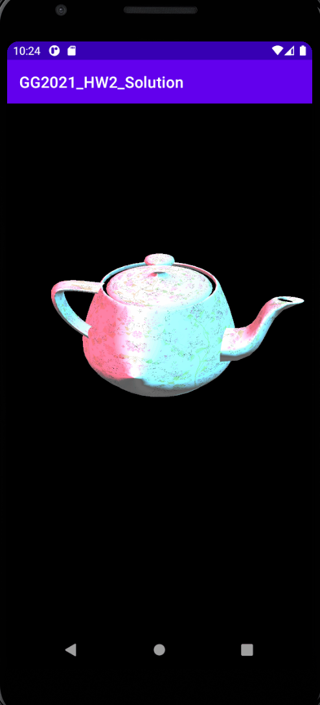

# Homework 2
The homework 2 tests your understand about rendering pipeline, texture, lighting, blending.  

* [Procedure](#procedure)
* [Result](#result)
* [Deadline](#deadline)
* [Q & A](#qa)

## Procedure
1. Download the files in this repository and unzip the GG2021_HW2.zip. 
   - (Password is required. Please check the e-campus information.)
2. Follow the instructions provided by GameGraphics_Homework2_Guide.pdf
3. Invest your time to achieve the goal!

## Result

## Deadline
* If spring class: 06.03. 23:59

## Q & A
* 1__dong@khu.ac.kr (한동현)
* Thank you for your star.
